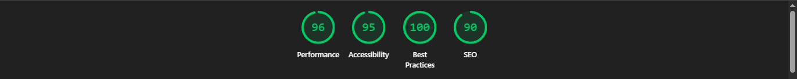
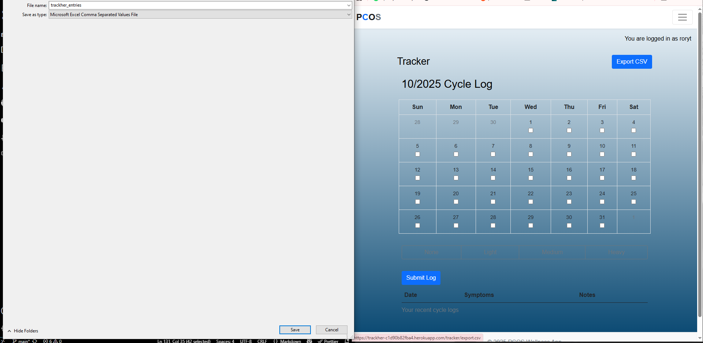
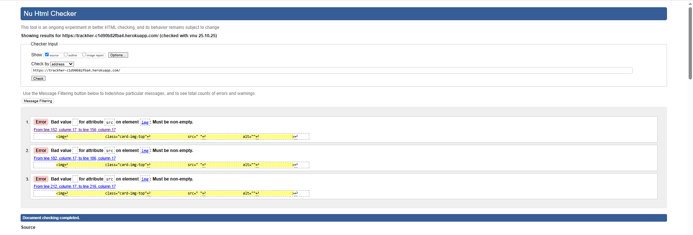
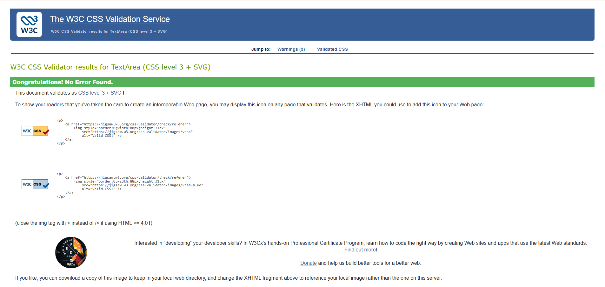

# Testing

Chrome DevTools, Lighthouse, and automated test suites (pytest/Jest) were used throughout development and on the deployed site to check functionality, accessibility, performance, and responsiveness.

---

## Accessibility Testing

- All interactive controls (calendar cells, flow buttons, checkboxes, submit/export links) have accessible names/labels.
- Form controls are associated with `<label>` or have `aria-label`.
- Headings follow a logical order (no skipped levels); page regions use semantic tags where possible.
- Images and icons include alternative text; purely decorative icons are hidden from AT (`aria-hidden="true"`).
- Keyboard navigation: tab order is logical; visible focus indicator present (Bootstrap defaults respected).
- Toast messages (success/error) announced via `role="status"`/`aria-live` where applicable.
- Color contrast meets WCAG AA; verified spot-checks in DevTools > Accessibility > Contrast.

**Outcome**
- Forms and buttons expose names to assistive tech.
- Focus rings visible on all interactive elements.
- No critical color-contrast failures detected on Bootstrap defaults.
- **Action item**: calendar-day selection uses `<input type="checkbox">` inside table cells; we kept the native control for screen-reader support and added a visible state on the parent `<td>` (class `selected-date`).

---

## Responsiveness

**Browsers**: Chrome, Edge, Firefox (latest)  
**Viewports**: 320px → desktop widescreen using DevTools Responsive Mode

**Steps to test**
1. Open the site (Home → Login → Tracker).
2. Open DevTools (Right click → Inspect) and switch to **Responsive**.
3. Drag width between 320px and large desktop.
4. Interact with the calendar, select multiple dates, choose a flow (None/Light/Medium/Heavy), submit log; open Resources and Export CSV (when logged in).

**Expected**
- Layout adapts without horizontal scrolling; tables wrap within container.
- Buttons remain tappable (min 44×44 CSS px target).
- No text overlaps.

**Actual**
- Behaved as expected on tested breakpoints; Bootstrap table and button groups flowed within the container.
- Toasts and messages stayed readable on narrow screens.

**Devices sanity-check**
- Samsung Galaxy S23 (Android/Chrome)
- iPhone 13 (iOS/Safari)
- Amazon Fire tablet (Silk/Chromium)
- Windows desktop (Chrome/Edge)

---

## Accessibility & Responsiveness Issues & Fixes

**Issue #1: Static asset path broke template rendering in tests**  
*Problem*: `` caused Whitenoise manifest lookup errors.  
*Fix*: Remove the extra `static/` prefix → `` in all templates.

**Issue #2: CI failing with empty SECRET_KEY**  
*Problem*: Django error during auth/message middleware in tests.  
*Fix*: Set `SECRET_KEY=test-secret` in GitHub Actions env; export locally when running pytest.

**Issue #3: Calendar selection state not mirrored visually**  
*Problem*: Checked boxes weren’t obvious on some themes.  
*Fix*: Add/remove `.selected-date` on the parent `<td>` on change; improves sighted keyboard users’ feedback.

**Issue #4: Multi-select flow application**  
*Problem*: Unclear how chosen flow applies to multiple selected dates.  
*Fix*: Flow buttons apply the chosen flow to all selected dates and submit `{ dates[], flow }` to the Django view. Jest tests cover this.

**Issue #5: Login-required redirects confusing on Sources/Export in dev**  
*Problem*: Hitting `/tracker/sources/` or export without a session redirected to `/tracker/`.  
*Fix*: Ensure `@login_required` + messages clarify the requirement; manual test: unauthenticated → 302 to login; authenticated → 200.

**Issue #6: Lighthouse semantics**  
*Problem*: Some landmarks missing on older template iterations.  
*Fix*: Use meaningful headings and labels; no remaining blocking issues.

---

## Lighthouse  
- **Before fixes**: Minor accessibility warnings (landmarks/labels), failing static URL.
- **After fixes**: Accessibility ≈100 on key pages; Performance varies by network; Best Practices/SEO within expected ranges.

> Numbers vary by device/network; capture fresh runs via Chrome DevTools → Lighthouse. Image above displays the average results for each page. 

---

## Functional Testing

### Navigation
Validated that primary routes resolve and respect auth:

| Navigation Link | Expected Target            | Guard              |
|---|---|---|
| Home           | `/`                         | Public             |
| Tracker        | `/tracker/`                 | Login required     |
| Export CSV     | `/tracker/export.csv`       | Login required; per-user data |
| Resources      | `/tracker/resources/`       | Public (or login if configured) |
| Sources        | `/tracker/sources/`         | Login required     |
| Login/Logout   | `/accounts/login/`, `/accounts/logout/` | Public/Login required |

All links navigated to the correct routes under the expected guard.

### Tracker: Calendar + Flow (core user journey)

**Scenario A – Correct inputs (single date)**
1. Login → go to **Tracker**.
2. Tick one calendar day (checkbox checked; `<td>` gets `.selected-date`).
3. Click a Flow button (e.g., **Medium**).
4. Submit.

**Expected**: 302 back to `/tracker/` with success toast; one `CycleLog` row for the selected date and chosen symptom.  
**Actual**: Behaved as expected.

**Scenario B – Multiple dates**
1. Select 2–5 dates.
2. Click a Flow button (**Light/Medium/Heavy/None**).
3. Submit.

**Expected**: All selected dates receive one row each with the chosen flow.  
**Actual**: Behaved as expected.

**Scenario C – Missing flow**
1. Select date(s) but do not click a flow button.
2. Submit.

**Expected**: Validation prevents an empty flow from being saved (client or server).  
**Actual**: Validation prevented save as expected.

**Scenario D – Not authenticated**
1. Visit `/tracker/` without logging in.

**Expected**: Redirect to login; after login, return to the tracker.  
**Actual**: Redirected as expected.

### Export CSV  
- **Authenticated**: only the requesting user’s rows are included; verified with two users in tests.  
- **Unauthenticated**: redirected to login.

---

## Validator Testing 

**HTML – W3C Validator**   
- Pages pass W3C validator with no blocking errors post-fix. Minor warnings acceptable for third-party attributes.

**CSS – W3C Jigsaw Validator**   
- No blocking errors in W3C CSS validator (Bootstrap vendor CSS excluded).

**JavaScript**  
- Unit tests (Jest) cover DOM interactions. 

---

## Automated Tests Summary 

**Backend (pytest + pytest-django)**
- `test_models.py`: uniqueness `(user, date)`, choices, ordering.
- `test_forms.py`: `CycleLogForm` validation rules.
- `test_views_auth.py`: login requirements for tracker, export, and submit endpoints.
- `test_export_csv.py`: per-user filtering; headers/CSV content checks.

**Frontend (Jest + jsdom)**
- `trackher.test.js`: calendar selection adds/removes `.selected-date`; flow button applies the chosen flow to all selected dates; minimal DOM via jsdom.

**CI (GitHub Actions)**
- Sets `DJANGO_SETTINGS_MODULE=trackher.settings` and `SECRET_KEY=test-secret`.
- Runs `pytest -q` and `npm test` on push/PR.

---

## Known/Unfixed Bugs

**UF-1: Google Sheets sorting/filters**  
Sorting historical logs directly within the Google Sheet is not performed server-side yet. As a workaround, the **Resources/Sources** pages provide curated references; CSV export allows local analysis.

**UF-2: Keyboard convenience on table grid**  
Arrow-key navigation between date cells is basic (relies on native tab order). Enhancement: add custom keyboard handling to move left/right/up/down within the grid.

**UF-3: Safari double-tap on button groups (edge)**  
Rarely, iOS Safari may require an extra tap to commit a flow after scrolling. Enhancement: ensure `touch-action: manipulation;` on flow buttons.

